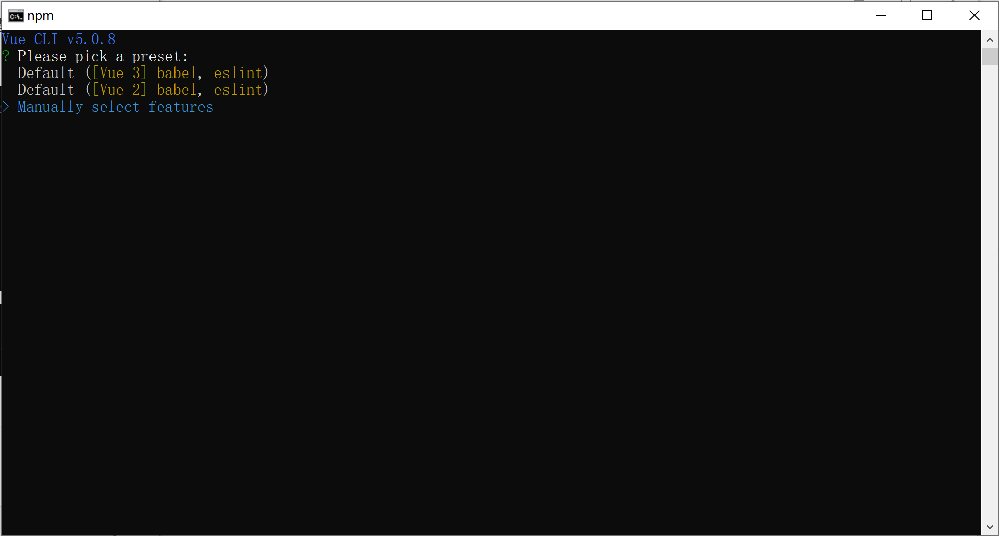
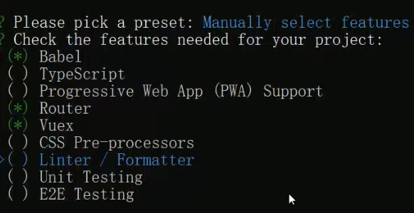
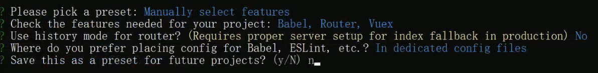
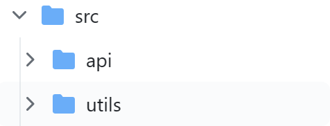

# xjdzy_frontend

## Project setup
```
npm install
```

### Compiles and hot-reloads for development
```
npm run serve
```

### Compiles and minifies for production
```
npm run build
```

### Customize configuration
See [Configuration Reference](https://cli.vuejs.org/config/).

## 开发文档

### 用vue脚手架搭建前端项目
1. 新建一个文件夹doubao_community_project，`cd`进入文件夹
2. 使用`vue create doubao_community_frontend`，进入创建项目引导
3. 选择`Manually select features`（手动选择），按回车将进入下一步

4. 按空格选择Babel,Router,Vuex，按回车进入下一步

5. 选择2.x版本，no，In package.json，no


### 开发过程
+ 安装buefy，`yarn add buefy`
+ 安装element-ui，`yarn add element-ui`
+ 在main.js里引入一下

   > ```javascript
   > // Buefy
   > import Buefy from 'buefy'
   > import 'buefy/dist/buefy.css'//导入样式
   > // ElementUI
   > import ElementUI from 'element-ui';
   > import 'element-ui/lib/theme-chalk/index.css';//导入样式
   > 
   > Vue.use(Buefy)//引用，之后可以在所有地方使用Buefy、ElementUI
   > Vue.use(ElementUI);
   > ```
+ 项目结构：
  + assets：放各种资源
  + components：整个项目页面的组件
  + router：定义路由
  + store：状态管理Vuex
  + views：构成网站的各个页面
  + App.vue：根节点（挂载）
  + main.js：相当于整个项目的入口
+ 安装axios，`npm install axios`
+ 在src文件夹下新建api文件夹，放所有向服务端发请求的代码，utils文件夹里放工具
+ 在utils下新建request.js，用来发请求的。

#### 用户注册前端实现
1. 在api文件夹新建一个auth（认证）文件夹，在里面添加一个auth.js，其中userDTO是参数传入函数的

   ```js
   import request from '@/utils/request'
   
   export function userRegister(userDTO) {
     return request({
       url: '/ums/user/register',
       method: 'post',
       data: userDTO
     })
   }
   ```
2. 在views文件夹下新建auth目录，其中创建一个Register.vue。再新建一个目录error，在里面新建一个404.vue

3. 配置路由，修改src/router/index.js，添加注册页面和404页面的路由

   ```js
   import Vue from 'vue'
   import VueRouter from 'vue-router'
   Vue.use(VueRouter)
   const routes = [
     {
       path: '/',
       name: 'Home',
       component: () => import('@/views/Home')
     },
     {
       path: '/register',
       name: 'register',
       component: () => import('@/views/auth/Register'),
       meta: { title: '注册' }
     },
     {
       path: '/404',
       name: '404',
       component: () => import('@/views/error/404'),
       meta: {title: '404-NotFound'}
     },
     {
       path: '*',	//如果用户输了除上面这几个url的路由，就重定向到404.vue
       redirect: '/404',
       hidden: true
     }
   ]
   const router = new VueRouter({
     routes
   })
   export default router
   ```

4. 404.vue

   ```vue
   <template>
     <div class="columns mt-6">	<!--buema样式-->
       <div class="column mt-6">
         <div class="mt-6">
           <p class="content">UH OH! 页面丢失</p>
           <p class="content subtitle mt-6">
             您所寻找的页面不存在， {{ times }} 秒后，将返回首页!
           </p>
         </div>
       </div>
     </div>
   </template>
   
   <script>
   export default {
     name: "404",
     data() {
       return {
         times: 10
       }
     },
     created() {
       this.goHome();
     },
     methods: {
       goHome: function () {
         this.timer = setInterval(() => {	//启动一个定时器
           this.times--
           if (this.times === 0) {
             clearInterval(this.timer)
             this.$router.push({path: '/'});	//当定时器见到零，就跳转到首页
           }
         }, 1000)
       }
     }
   }
   </script>
   
   <style scoped>
   </style>
   ```

5. Register.vue。

   >  v-model(:model)=""双向绑定，输入啥，对象里的值是啥
   >
   > 点击立即注册el-button按钮时，调用submitForm函数，会传进来一个formname。通过`this.$refs[formName]`就能引用到真实的表单对象
   >
   > validate校验：校验表单里填写的是否满足条件，这里面有一个回调函数(valid) => {...}
   >
   > 回调函数里面传进来一个参数valid，校验成功，该值为true，否则为false。
   >
   > 如果true，把loading设为true，表单上的这两个按钮就不能点击了。
   >
   > 然后就调用api/auth/auth.js的接口userRegister，把表单对象传进去，发送给服务器。
   >
   > .then()如果服务器返回了，接收服务器返回的json数据value
   >
   > ```js
   > <el-button type="primary" @click="submitForm('ruleForm')">立即注册</el-button>
   > ...
   > submitForm(formName) {
   >       this.$refs[formName].validate((valid) => {
   >         if (valid) {
   >           this.loading = true
   >           userRegister(this.ruleForm)
   >             .then((value) => {
   >               const { code, message } = value
   >               if (code === 200) {
   >                 this.$message({
   >                   message: '账号注册成功',
   >                   type: 'success'
   >                 })
   >                 setTimeout(() => {
   >                   this.loading = false
   >                   this.$router.push({ path: this.redirect || '/login' })
   >                 }, 0.1 * 1000)
   >               } else {
   >                 this.$message.error('注册失败，' + message)
   >               }
   >             })
   >             .catch(() => {
   >               this.loading = false
   >             })
   >         } else {
   >           return false
   >         }
   >       })
   >     },
   > ```
   >
   > 

   ```vue
   <!--  Register.vue -->
   <template>
     <div class="columns py-6">
       <div class="column is-half is-offset-one-quarter">
         <el-card shadow="never">
           <div slot="header" class="has-text-centered has-text-weight-bold">
             新用户入驻
           </div>
           <div>
             <el-form
               ref="ruleForm"		<!--引用属性-->
               v-loading="loading"
               :model="ruleForm"	<!--双向帮端盖model：绑定ruleform对象-->
               status-icon
               :rules="rules"
               label-width="100px"
               class="demo-ruleForm"
             >
               <el-form-item label="账号" prop="name">
                 <el-input v-model="ruleForm.name" />
               </el-form-item>
   
               <el-form-item label="密码" prop="pass">
                 <el-input
                   v-model="ruleForm.pass"
                   type="password"
                   autocomplete="off"
                 />
               </el-form-item>
   
               <el-form-item label="确认密码" prop="checkPass">
                 <el-input
                   v-model="ruleForm.checkPass"
                   type="password"
                   autocomplete="off"
                 />
               </el-form-item>
   
               <el-form-item label="邮箱" prop="email">
                 <el-input v-model="ruleForm.email" autocomplete="off" />
               </el-form-item>
   
               <el-form-item>
                 <el-button
                   type="primary"
                   @click="submitForm('ruleForm')"
                 >立即注册</el-button>
                 <el-button @click="resetForm('ruleForm')">重置</el-button>
               </el-form-item>
             </el-form>
           </div>
         </el-card>
       </div>
     </div>
   </template>
   
   <script>
   import { userRegister } from '@/api/auth/auth'
   export default {
     name: 'Register',
     data() {
       const validatePass = (rule, value, callback) => {	//验证密码
         if (value === '') {
           callback(new Error('请再次输入密码'))
         } else if (value !== this.ruleForm.pass) {
           callback(new Error('两次输入密码不一致!'))
         } else {
           callback()
         }
       }
       return {
         loading: false,
         ruleForm: {		//表单的字段
           name: '',
           pass: '',
           checkPass: '',
           email: ''
         },
         rules: {	//校验规则
           name: [
             { required: true, message: '请输入账号', trigger: 'blur' },
             {
               min: 2,
               max: 10,
               message: '长度在 2 到 10 个字符',
               trigger: 'blur'		//触发器
             }
           ],
           pass: [
             { required: true, message: '请输入密码', trigger: 'blur' },
             {
               min: 6,
               max: 20,
               message: '长度在 6 到 20 个字符',
               trigger: 'blur'
             }
           ],
           checkPass: [
             { required: true, message: '请再次输入密码', trigger: 'blur' },
             { validator: validatePass, trigger: 'blur' }
           ],
           email: [
             { required: true, message: '请输入邮箱地址', trigger: 'blur' },
             {
               type: 'email',
               message: '请输入正确的邮箱地址',
               trigger: ['blur', 'change']
             }
           ]
         }
       }
     },
     methods: {
       submitForm(formName) {
         this.$refs[formName].validate((valid) => {
           if (valid) {
             this.loading = true
             userRegister(this.ruleForm)
               .then((value) => {
                 const { code, message } = value
                 if (code === 200) {
                   this.$message({
                     message: '账号注册成功',
                     type: 'success'
                   })
                   setTimeout(() => {
                     this.loading = false
                     this.$router.push({ path: this.redirect || '/login' })
                   }, 0.1 * 1000)
                 } else {
                   this.$message.error('注册失败，' + message)
                 }
               })
               .catch(() => {
                 this.loading = false
               })
           } else {
             return false
           }
         })
       },
       resetForm(formName) {
         this.$refs[formName].resetFields()
       }
     }
   }
   </script>
   
   <style scoped>
   </style>
   ```
#### JWT（Json Web Token）以及Web通信流程

```
客户端						服务端
一些功能需要登录才能使用
前端输入用户名、密码，发送给后端，后端收到以后查一下数据库信息是否正确。
对了，后端会根据用户名/用户ID生成JWT，就是加密之后的字符串，
生成之后会把JWT返回给客户端，客户端拿到之后会保存在本地的存储中（LocalStorage/JSCookie）。保存时间自订的。
之后，客户端每一次向服务器发任何请求，都会把JWT放在HTTP请求头里发给服务器。
服务器收到请求后，会把token从请求头里拿出来，解密出用户信息，查询数据库后就知道用户是谁了。
```

#### Vuex简介
+ vuex是vue的状态管理库。组件之间需要通信。有一个store，里面有状态变量state，里面可以定义很多对象。组件都可以获取。
+ 教程：手把手教你使用Vuex，猴子都能看懂的教程
https://juejin.cn/post/6928468842377117709

#### Js-cookie
1. 安装，`npm install js-cookie`

2. 前端项目新建utils/auth.js管理cookie
```js
import Cookies from 'js-cookie'

const uToken = 'u_token'

// 获取Token
export function getToken() {
    return Cookies.get(uToken);
}

// 设置Token，1天,与后端同步
export function setToken(token) {
    return Cookies.set(uToken, token, {expires: 0.1})
}

// 删除Token
export function removeToken() {
    return Cookies.remove(uToken)
}

export function removeAll() {
    return Cookies.Cookies.removeAll()
}
```

#### 用户登录前端实现

1. 实现登录功能，首先要在router/index.js里添加一条路由

   ```js
     // 登录
     {
       name: 'login',
       path: '/login',
       component: () => import('@/views/auth/Login'),
       meta: { title: '登录' }
     },
   ```

2. 在views/auth/目录下新建Login.vue

   > 点击提交按钮后，下面代码是向Vuex发送
   >
   > ```
   > this.$store
   > 	.dispatch("user/login", this.ruleForm)
   > ```

   ```vue
   <template>
       <div class="columns py-6">
         <div class="column is-half is-offset-one-quarter">
           <el-card shadow="never">
             <div slot="header" class="has-text-centered has-text-weight-bold">
               用户登录
             </div>
             <div>
               <el-form
                 v-loading="loading"
                 :model="ruleForm"
                 status-icon
                 :rules="rules"
                 ref="ruleForm"
                 label-width="100px"
                 class="demo-ruleForm"
               >
                 <el-form-item label="用户名" prop="username">
                   <el-input v-model="ruleForm.username"></el-input>
                 </el-form-item>
     
                 <el-form-item label="密码" prop="password">
                   <el-input
                     type="password"
                     v-model="ruleForm.password"
                     autocomplete="off"
                   ></el-input>
                 </el-form-item>
                   
                 <el-form-item>
                   <el-button type="primary" @click="submitForm('ruleForm')"
                     >提交</el-button
                   >
                   <el-button @click="resetForm('ruleForm')">重置</el-button>
                 </el-form-item>
               </el-form>
             </div>
           </el-card>
         </div>
       </div>
     </template>
     
     <script>
     export default {
       name: "Login",
       data() {
         return {
           redirect: undefined,
           loading: false,
           ruleForm: {
             username: "",
             password: ""
           },
           rules: {
             username: [
               { required: true, message: "请输入用户名", trigger: "blur" },
               {
                 min: 1,
                 max: 20,
                 message: "长度在 1 到 20 个字符",
                 trigger: "blur",
               },
             ],
             password: [
               { required: true, message: "请输入密码", trigger: "blur" },
               {
                 min: 6,
                 max: 20,
                 message: "长度在 6 到 20 个字符",
                 trigger: "blur",
               },
             ],
           },
         };
       },
       methods: {
         submitForm(formName) {
           this.$refs[formName].validate((valid) => {
             if (valid) {
               this.loading = true;
               this.$store
                 .dispatch("user/userLogin", this.ruleForm)
                 .then(() => {
                   this.$message({
                     message: "恭喜你，登录成功",
                     type: "success",
                     duration: 2000,
                   });
                   setTimeout(() => {
                     this.loading = false;
                     this.$router.push({ path: this.redirect || "/" });
                   }, 0.1 * 1000);
                 })
                 .catch(() => {
                   this.loading = false;
                 });
             } else {
               return false;
             }
           });
         },
         resetForm(formName) {
           this.$refs[formName].resetFields();
         },
       },
     };
     </script>
     
     <style scoped>
     </style>
   ```

3. 在api/auth/auth.js文件里添加登录接口

   ```js
   // 前台用户登录
   export function login(data) {
     return request({
       url: '/login',
       method: 'post',
       data
     })
   }
   ```

4. 为了实现前台登录功能，还新建了store/modules/user.js      (Vuex)

   > state里的数据的改变必须通过commit mutations进行

   ```js
   /* store/modules/user.js */
   import { login } from '@/api/auth/auth'
   import { getToken, setToken } from '@/utils/auth'
   
   //定义全局状态数据
   const state = {
       token: getToken(), // token
       user: '', // 用户对象
     }
   
   const mutations = {
       setTokenState(state, token){
           state.token = token
       }
   }
   
   //actions解决异步请求（指请求数据后不等待数据返回，直接去做别的事，当数据返回时，再通过回调函数）
   const actions = {
       // 用户登录的方法
       userLogin({ commit }, userInfo) {		//这里的userLogin是给dispatch调用的（dispatch("user/userLogin", this.ruleForm)）
         console.log(userInfo)
         const { username, password } = userInfo
         return new Promise((resolve, reject) => {
           login({ username: username.trim(), password: password }).then(response => {//这里的login是'@/api/auth/auth'里的登录接口
             const { data } = response
             commit('setTokenState', data.token)	//存到store.state里
             setToken(data.token)		//存到cookie里
             resolve()
           }).catch(error => {
             reject(error)
           })
         })
       },
     }
   
   ```

5. 在store/index.js里以模块为单位存放数据，这里识别到了store/modules/user.js

   ```js
   ...
   export default new Vuex.Store({
     state: {
     },
     getters: {
     },
     mutations: {
     },
     actions: {
     },
     modules: {
       user
     },
   })
   ```

6. this.$store.dispatch("user/userLogin", this.ruleForm)
              

          > dispatch先制定store里的模块名，再指定函数名。

7. 在store里新添的getters.js

      ```js
      /*store/getters.js*/
      const getters = {
          token(state){
              return state.user.token;   // token
          },
          user(state){
              return state.user.user;     // 用户对象
          }
        }
        export default getters
      
      
      /*store/index.js*/
      ...
      export default new Vuex.Store({
        state: {
        },
        getters: {
        },
        mutations: {
        },
        actions: {
        },
        modules: {
          user
        },
        getters
      })
      
      ```

#### 前端在axios请求拦截器中在请求头中加入jwt

1. 增加一个请求拦截器，请求拦截器会在每个请求之前拦截，是很好加上token的地方。

2. request.use函数里面有一个config对象是拦截器默认传进来的参数

3. 如果store.getters.token是true的话，往请求头中的token属性写token

   ```js
   // 2.请求拦截器request interceptor
   service.interceptors.request.use(
     config => {
       // 发请求前做的一些处理，数据转化，配置请求头，设置token,设置loading等，根据需求去添加
       // 注意使用token的时候需要引入cookie方法或者用本地localStorage等方法，推荐js-cookie
       if (store.getters.token) {
         // config.params = {'token': token}    // 如果要求携带在参数中
         // config.headers.token = token;       // 如果要求携带在请求头中
         // bearer：w3c规范
         config.headers['token'] = getToken()
       }
       return config
     },
     error => {
       // do something with request error
       console.log(error) // for debug
       return Promise.reject(error)
     }
   )
   ```